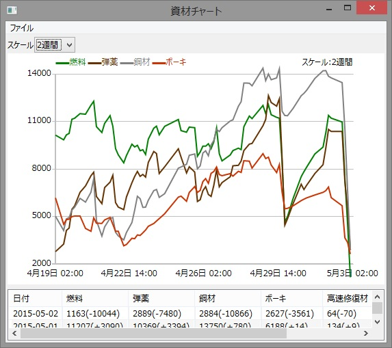
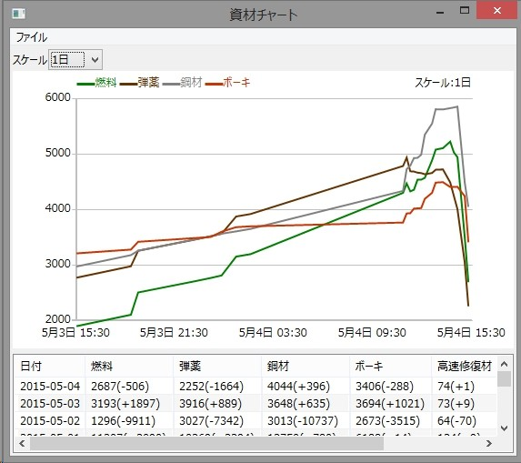
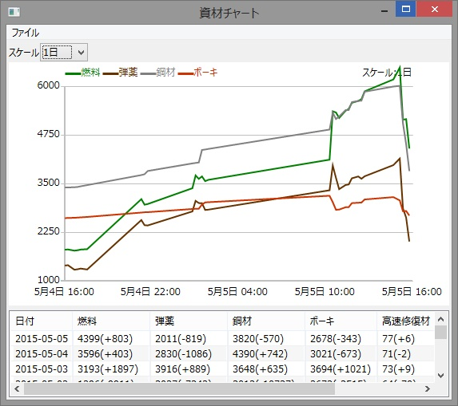
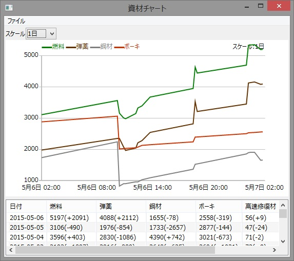
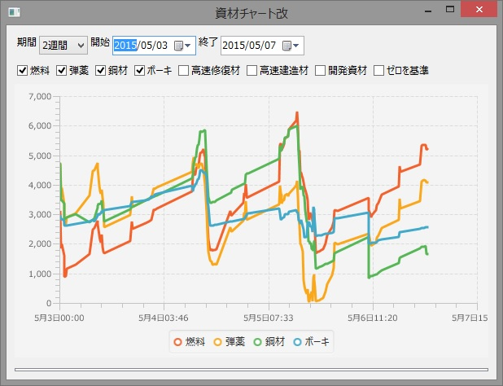

<link rel="stylesheet" type="text/css" href="kancolle.css">

# 概要

* 期間
	* 4/28～5/18
* 新艦
	* クリア報酬：葛城、Littorio、秋津洲
	* ドロップ：高波、Roma、
* 報酬
	* E-1丙：試製35.6cm三連装砲
	* E-2丙：彗星601、WG42？、葛城
	* E-3丙：
* ドロップ [まとめ](http://kancolle.doorblog.jp/archives/44524435.html)
	* E-1：鈴谷、大淀、天津風、谷風、雪風、浜風、浦風
	* E-2：鈴谷、雲龍、夕雲、秋雲、鬼怒、舞風、瑞鶴、翔鶴
	* E-3：鈴谷、三隈、高波、巻雲、島風、時津風、伊19、伊168、伊58、伊8、まるゆ
	* E-4：鈴谷、三隈、あきつ丸、翔鶴、瑞鶴、まるゆ
	* E-5：鈴谷、朝雲、山雲、矢矧、磯風、まるゆ、長門
	* E-6：Roma、U-511、酒匂、長門、加賀、鬼怒、まるゆ

# 攻略メモ

## E-1 丙 (4/28)

作戦は『丙』を選択。特に難なくクリアした。

## E-2 乙→丙 (4/28-4/29)

作戦は『乙』を選択。機動艦隊を組むも敵の火力に阻まれ大破撤退を繰り返す。
レベリングもしてみたもののやはり消耗の厳しさに継戦不能と判断。
『作戦：丙』に変更。更に水上艦隊に切り替え安定を目指す。
特に致命的な損傷も出ずバケツと資源を使いながら戦闘を継続し勝利。

なお、ボスドロップで伊8が出ている。自分は潜水艦との縁が深いようだ。

燃料弾丸が各3000、バケツが20ぐらい。残るイベントクエストは4つ、連合艦隊で行う海域はしっかりと対策を立てて資源消耗を抑えるべきである。さもないと、E-6到達を待たずして資源が枯渇するだろう。

## E-3 丙 (4/29)

作戦は迷わず『丙』を選択。難なくクリア。燃料弾丸は1000も使ってなかったはずだ。

## E-4 丙 (4/30-5/3)

再び連合艦隊。資源節約の策が決まり次第出撃する予定。

激はまりして伝説のグラフを残す。

## E-5 (5/3)

特に苦戦した覚えはない。

## E-6 (5/3-5/9?)

### 初回出撃(調査)

「勝てるには勝てるけど勝率悪くて資材落ちる」。

### 第2アタック

その後調整を重ねて出撃、必勝パターンを構築できた。
ただし消耗が激しいので更なる編成の考察が必要である。

編成は
[かんむす！](http://kanmusu.blomaga.jp/articles/42415.html)
や
[ていとくやろーよ！](http://nanashki.blog.fc2.com/blog-entry-415.html)
を参考にした。

### 第3アタック

勝率が落ちた。制空のために艦攻ガン積みは前回と同じはずなのだが…。

### 資源徴収

変に欲が出て加賀堀りでドはまり。やっちまった。
減った資源を必死に取り戻す。建造や開発も我慢。

### 苦闘の末に…

ここに経過グラフが入る予定。

### 参考編成

第一

第二(連撃重視)

第二(カットイン重視)

# 掘り (5/10?-5/18)

最低でも3～4日は充てたい。資源補充のターンを考えると、海域攻略には10日程度が使える計算である。レベリングを掘り対象海域で行うなどして、合計時間を節約することを考える必要がある。

## E-1
### クリア後レベリング時
谷風

## E-2
### 乙チャレンジ時
清霜

## E-3
### 攻略時
伊168、伊8

## E-6
### 攻略中
