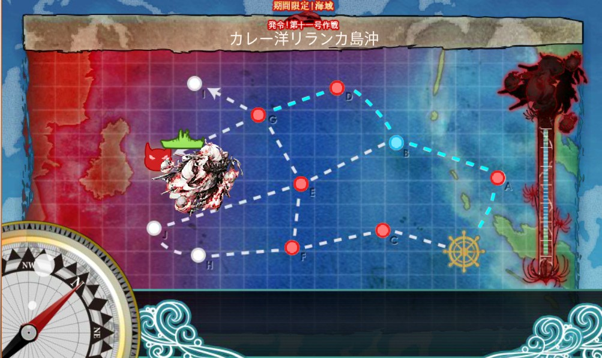
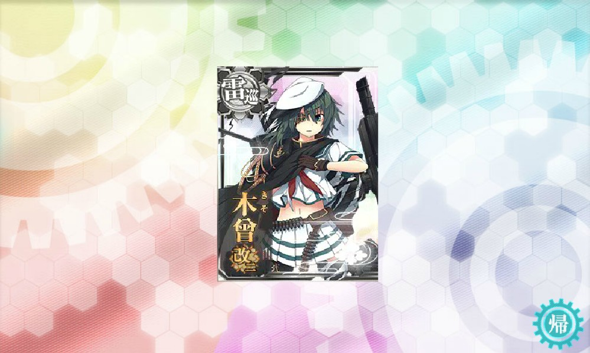

<link rel="stylesheet" type="text/css" href="kancolle.css">

# 概要

* 期間
	* 4/28～5/18
* 新艦
	* クリア報酬：葛城、Littorio、秋津洲
	* ドロップ：高波、Roma、
* 報酬
	* E-1丙：試製35.6cm三連装砲
	* E-2丙：彗星601、WG42？、葛城
	* E-3丙：
* ドロップ(暫定) [参考](http://kancolle.doorblog.jp/archives/44524435.html)
	* E-1：鈴谷、大淀、天津風、谷風、雪風、浜風、浦風
	* E-2：鈴谷、雲龍、夕雲、秋雲、鬼怒、舞風、瑞鶴、翔鶴
	* E-3：鈴谷、三隈、高波、巻雲、島風、時津風、伊19、伊168、伊58、伊8、まるゆ
	* E-4：鈴谷、三隈、あきつ丸、翔鶴、瑞鶴、まるゆ
	* E-5：鈴谷、朝雲、山雲、矢矧、磯風、まるゆ、長門
	* E-6：Roma、U-511、酒匂、長門、加賀、鬼怒、まるゆ

# 攻略メモ

## E-1 丙 (4/28)

作戦は『丙』を選択。

途中で瑞鳳さんドロップ

特に難なくクリアした。

## E-2 乙→丙 (4/28-4/29)

作戦は『乙』を選択。機動艦隊を組むも敵の火力に阻まれ大破撤退を繰り返す。
レベリングもしてみたもののやはり消耗の厳しさに継戦不能と判断。
『作戦：丙』に変更。更に水上艦隊に切り替え安定を目指す。
特に致命的な損傷も出ずバケツと資源を使いながら戦闘を継続し勝利。

なお、ボスドロップで伊8が出ている。自分は潜水艦との縁が深いようだ。

燃料弾丸が各3000、バケツが20ぐらい。残るイベントクエストは4つ、連合艦隊で行う海域はしっかりと対策を立てて資源消耗を抑えるべきである。さもないと、E-6到達を待たずして資源が枯渇するだろう。

## E-3 丙 (4/29)

作戦は迷わず『丙』を選択。難なくクリア。燃料弾丸は1000も使ってなかったはずだ。

クリア報酬とドロップの五十鈴さん。

## E-4 丙 (4/30-5/3)

再び連合艦隊。資源節約の策が決まり次第出撃する予定。

激はまりして伝説のグラフを残す。

## E-5 (5/3)

特に苦戦した覚えはない。

ラストダンス突破で陸奥さんが出た。

## E-6 (5/3-5/8)

### 初回出撃(調査)

「勝てるには勝てるけど勝率悪くて資材落ちる」。

ちなみにここで木曾が改二になった。

### 第2アタック

その後調整を重ねて出撃、必勝パターンを構築できた。
ただし消耗が激しいので更なる編成の考察が必要である。

編成は
[かんむす！](http://kanmusu.blomaga.jp/articles/42415.html)
や
[ていとくやろーよ！](http://nanashki.blog.fc2.com/blog-entry-415.html)
を参考にした。

### 第3アタック

勝率が落ちた。制空のために艦戦ガン積みは前回と同じはずなのだが…。

### 資源徴収

変に欲が出て加賀堀りでドはまり。やっちまった。
減った資源を必死に取り戻す。建造や開発も我慢。

### 第4アタック

これだと逸れた → FGL  
戦艦2隻に電探を載せた → FGL  
まだ足りない。神通から夕張に変えて電探2個追加 → FGL  
あかん！？雷巡3隻から2隻に変更。大井out摩耶in → FGIM

どうにか安定したので周回開始。
消耗は激しいものの勝てない相手ではない。
燃料弾丸とバケツを消費して進めた。

## ラストダンス

### 艦隊編成

ようやく本イベントのクライマックス。
確実に削り切るため決戦支援も追加し万全の状態での出撃。

第一艦隊  

第二艦隊

決戦支援艦隊  

### ラストダンス開始

ボスからの有り難いお言葉。
しかし、これで終わりだ・・・！

敵影を観測、狙わせてもらうっ

うっし

どごーん (削れるとは言っていない)

支援艦隊(ﾟ∀ﾟ)ｷﾀｺﾚ!!

やるぅ

先行雷撃！分かりにくいけど、中破(49ダメ)と大破(100ダメ)。

砲撃！

これも！雷撃！！

これで削り切るよ！

無事撃破…。長かった…。

ゲット！

終わったー。

### 戦い切ったなー

やっぱり激ハマりしてた時がいちばん消耗が激しいｗ

### 参考編成

第一

第二(連撃重視)

第二(カットイン重視)

# 掘り (5/9-5/18)

1マップで目的の艦をドロップするのに2日は掛かる。
レベリングや司令部入手との兼ね合いを考え
『E-1(大淀)→E-3(高波)→E-6(Roma)』と掘っていく。
なおE-2(雲龍)は連合艦隊の負荷の関係上、今回は見送る。

この時点で6日、資源補充のことも考えるとさらに3日。
9日程度は掘り日数を用意したいところである。

## E-1
### クリア後レベリング時
谷風

## E-2
### 乙チャレンジ時
清霜

## E-3
### 攻略時
伊168、伊8

## E-6
### 攻略中
