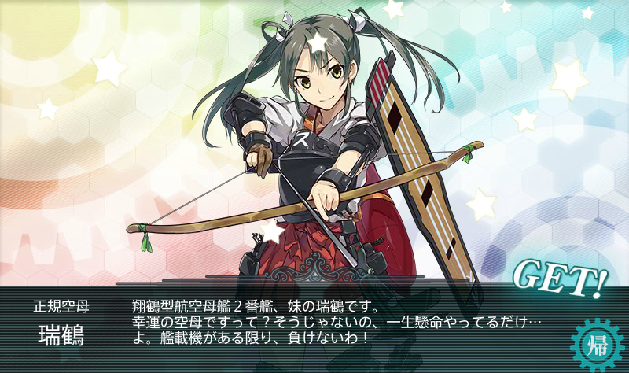
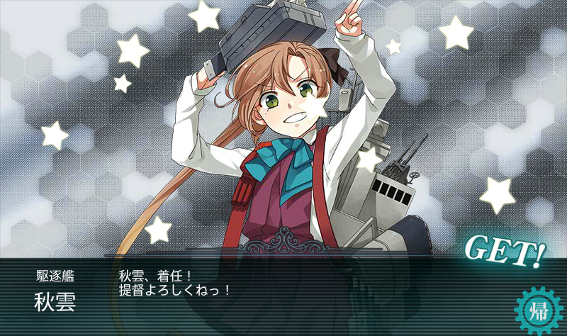

<link rel="stylesheet" type="text/css" href="kancolle.css">

# 概要

* 期間
	* 08/10～8/30?
* 新艦
	* クリア報酬：江風(E2)、速吸(E4)、Libeccio(E5)、照月(E7)
	* ドロップ：瑞穂、海風、
* 報酬 [参考](http://zekamashi.net/category/201508-event/)
	* E-1：【丙】補強増設1,戦闘糧食2 + 【乙】伊良湖1,戦闘糧食1 +【甲】家具職人1,補強増設1,戦闘糧食
	* E-2：【丙】なし +【乙】補強増設1 +【甲】戦闘糧食2,91式高射装置
	* E-3：【丙】補強増設1,応急修理要員1 +【乙】１５m二重測距儀＋２１号電探改二 +【甲】補強増設1,応急修理女神1,改修資材3
	* E-4：【丙】洋上補給1,戦闘糧食1 +【乙】洋上補給1,改修資材3 +【甲】勲章1,改修資材2,洋上補給1,戦闘糧食1
	* E-5：【丙】なし +【乙】洋上補給1,戦闘糧食2 +【甲】洋上補給1,改修資材7,勲章1
	* E-6：【丙】? +【乙】改修資材6,洋上補給2,試製甲板用カタパルト,勲章？ +【甲】改修資材4,補強施設1,洋上補給1,勲章
	* E-7：【丙】 +【乙】 +【甲】
* ドロップ(暫定) [参考](http://kancolle.doorblog.jp/archives/44524435.html)
	* E-1：野分 時津風 大淀 浦風 谷風
	* E-2：春雨 衣笠	大鯨 阿賀野 初風 巻雲 能代 翔鶴 瑞鶴 雲龍 瑞鳳
	* E-3：磯風 瑞穂 まるゆ
	* E-4：早霜 秋雲 夕雲 明石 まるゆ 雪風 舞風 海風 朝霜 清霜 高波 巻雲 野分 天津風 矢矧 明石
	* E-5：U-511 Roma
	* E-6：風雲
	* E-7：風雲

# 攻略メモ

## 概要

* ルート　E1丙 → E2丙 → E3乙 → E4丙 → E5丙 → E6乙 → E7丙
* E3 1,2の部隊使えない
* E6 1,2,4,5の部隊使えない

## ルート固定

E-1：菊月改
E-2：特になし
E-3：瑞鳳？
E-4：金剛＆榛名か比叡＆霧島と綾波、夕立、春雨から2
E-5：編成がよければコイツってのは無し？
E-6：瑞鶴・翔鶴・瑞鳳＋吹雪・秋月？
E-7：不明

## 参考URL

[効率良く夏イベントを進める方法](http://akankorebiyori.blog.fc2.com/blog-entry-165.html)

### 札情報

* 初動作戦 (E1,E2,E7)
* 機動部隊 (E3,E6,E7)
* 挺身部隊 (E4,E7)
* 西部方面 (E5)

## E-0 作戦開始前

バケツ 

資材 

## E-1 丙 (08/14)

第一艦隊：妙高 / 伊8改 / 祥鳳 / 五十鈴改 / 雷改 / 電改
決戦支援：伊勢改 / 扶桑改 / 瑞鳳 / 最上 / 三隈 / 菊月

なんなく攻略。

## E-2 丙 (08/14)

第一艦隊：戦艦2、重巡（航巡）2、軽空母2
第二艦隊：駆逐4、軽巡1、重巡1

第一艦隊：妙高 / 扶桑改 / 伊勢改 / 祥鳳 / 瑞鳳 / 最上改
第二艦隊：響改 / 暁改 / 雷改 / 電改 / 五十鈴 三隈改
決戦支援：大和改 / 陸奥改 / 赤城改 / 飛龍改 / 雪風改 / 島風改

## E-3 丙 (08/14)

* 1,2の部隊使えない
* E6に使いたい艦を選択すること

第一艦隊：軽空母2、正規空母2、戦艦2
第二艦隊：駆逐2、軽巡1、重巡2、雷巡1

E-6に連なる乙作戦の一発目である。

第一艦隊：大和改 / 陸奥改 / 赤城改 / 飛龍改 / 千代田改二 / 千歳改二
第二艦隊：雪風改 / 摩耶改二 / 筑摩改二 / 北上改二 / 阿武隈 / 島風改
決戦支援：比叡改 / 榛名改 / 蒼龍改 / 翔鶴改 / 夕立改 / 時雨改

### 作戦難度調査

乙作戦にて試験出撃。
うちの精鋭艦隊をもってしてもボスを削り切れず、
艦の破損も激しく消耗が酷い。
到達目標から鑑みても本海域で立ち止まるわけにはいかない。
乙作戦から丙作戦への変更を決定した。

### 攻略

決戦支援まで入れることで火力を確保。
資源は消耗したが海域の突破に成功。

瑞鶴ゲット

秋雲ゲット

## E-4 丙 (08/14-)

* E1～E3の札が付いた艦娘で攻略すること。

第一艦隊：重巡1、戦艦4、軽空母1
第二艦隊：

金剛＆榛名

第一艦隊：千代田改二 / 榛名改 / 金剛改 / 雪風改 / 島風改 / 千歳改二

### 削り

決戦支援出すから消耗がきつい

### ラストダンス 挑戦1回目

火力不足を感じる・・・。 

### 艦隊増強

## E-5 丙 (08/xx)

E1～E4までの札が付いた艦娘で攻略すること。

## E-6 乙 (08/xx)

* 1,2,4,5の部隊使えない
* じごく

第一艦隊：戦艦、航戦、正規空母4
第二艦隊：軽巡1、駆逐2、重巡2、戦艦1

第一艦隊：摩耶改二 / 山城改 / 赤城改 / 飛龍改 / 蒼龍改 / 翔鶴改
第二艦隊：阿武隈 / 吹雪改 / 利根改 / 時雨改 / 熊野改 / 大和

## E-7 丙 (08/xx)

# 掘り (08/xx-08/xx)

# 攻略時ドロップ

# E-1 xxxx掘り (08/xx-08/xx)

## 検討事項などなど (08/xx)
