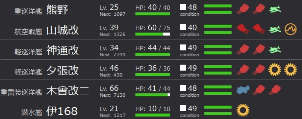
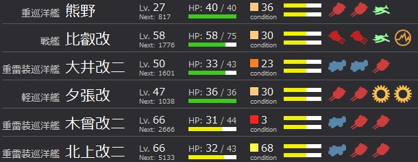
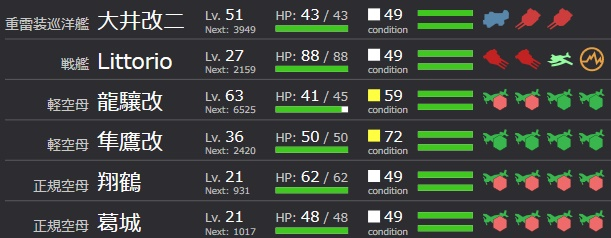
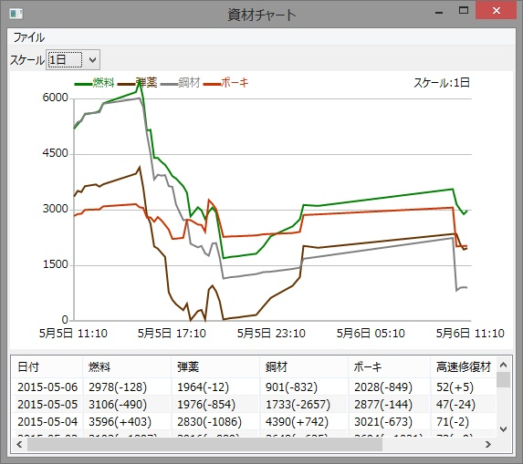

# 概要

* 期間
	* 4/28～
* 狙えるMap
	* 3-1：道中S勝利(0.45％～)、ボスS勝利(5.52％～)
	* 2-3：ボスS勝利(0.27％～)
	* 2-2：ボスS勝利(0.40％～)

# 5/5 ボスドロ狙い(3-1,3-2)

## 戦/重/雷/軽空/軽空/潜

まずボスに行かない。
5出撃→全て北方マスへ・・・。
ボーキ消耗が辛いので編成を変える。

## 戦/重/雷/軽/軽/潜

ボーキ消耗を嫌って雷巡構成に。
羅針盤が南方に向かうようになった。
しかし大破が多く火力不足を感じる。

## 戦/重/雷/雷/雷/軽

火力アップを狙う。
相変わらず南方よりだが、微妙に羅針盤がズレる。

## 戦/重/重/雷/雷/軽

雷巡ローテや羅針盤などを考慮して再編成。
熊隈コンビのレベリングも兼ねるなど。

しかし火力不足によりボスを削り切れない。
残存部隊に殲滅させられてどうしようもなくなる。

むしろ火力を上げるべきかもしれない。

## 編成を変える

* (1回→北) 戦/戦/重/重/雷/雷
* (2回→北) 戦/戦/重/重/空/軽空
* (1回→北) 戦/雷/雷/雷/空/軽空

やはり索敵値の問題か。

## 索敵を上げてみる

制空値：150、索敵値：68.22
→A、DE(ボス)、A、A、DF

しかし削り切れない。

## ボスを倒すことだけ考える

逸れる。辛い。

## キレちまったぜ

ああああああああああああああああ

DF、D(艦娘MAXになり撤収orz)、DF、DF、AB、DF

## 3-3ボス狙い

たどり着く前に大破撤退

## やりすぎた…

その結果がこの有り様だよ！！

だから何で空母建造なんてやっちゃうかなぁ・・・
